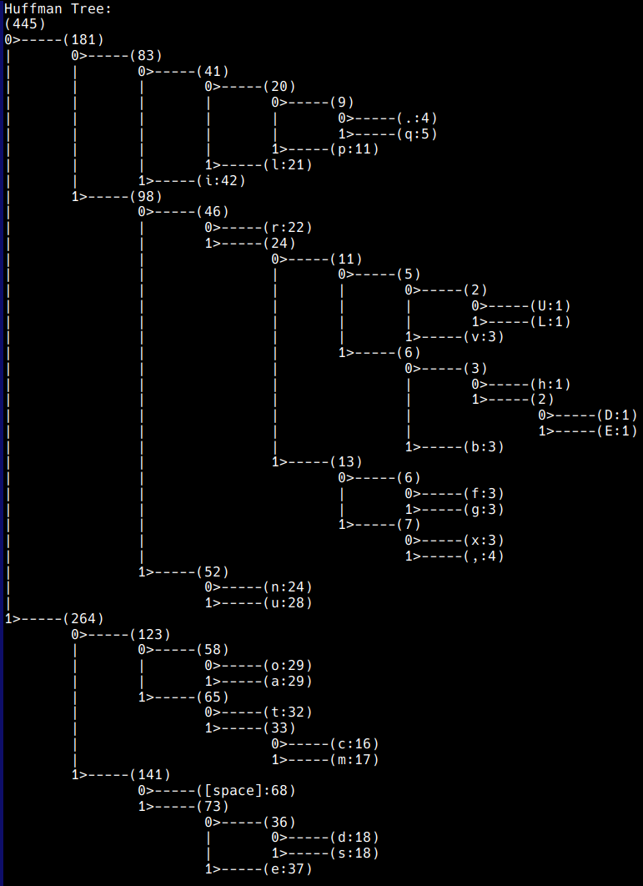
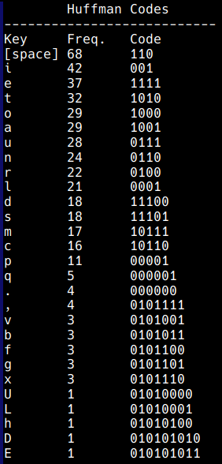

# HuffmanCoder

*An interactive command line program for lossless compression of text with Huffman codes.*

Huffman coding is a method of lossless data compression where common characters are assigned shorter binary codes, while uncommon characters are reserved with longer codes. These binary codes can be used to retrieve the original character by traversing a pre-constructed Huffman binary tree that will end in a leaf node containing the original character. In this way, the text information can be stored using fewer bits, alongside a corresponding binary-tree key to retrieve _all_ the original textual information. 

This program uses a priority queue of character frequency nodes (least have priority) to construct a Huffman table and Huffman (binary) tree for encoding and decoding character strings. The Huffman tree places the most infrequent characters at greater depths and vice versa. It then may be traversed to create a Huffman Table that is a character-to-binary reference. That table may be used to encode the most frequent characters in a string with the fewest bits of binary values. The tree may then be used to decode those Huffman codes by searching the tree based on the binary code value until a character value leaf is located.

This program was created by Kirkwood Donavin starting in 2016 for a Data Structures and Algorithms course @ Montana State University. 

## Installation

To use the HuffmanCoder application, simply run the included `install.sh` script:

1. Execute the `install.sh` script to build the `huffman_coder.jar` and create a convenient executable wrapper script called `huffman`.
2. Ensure the executable (`huffman`) is placed in a directory that is in your system's `PATH` (e.g., `~/.local/bin`). The installer will do this by default if you have `~/.local/bin` in your `PATH`.
3. Run the HuffmanCoder application from the command line with:
	```
	huffman
	```

## Usage	
	
With no arguments, `huffman` enters an interactive command-line application to demonstrate Huffman Coding. Files may be read in, encoded, and then a summary printed (limited to 500 characters or bits). 

Within the interactive mode, a binary Huffman tree may be printed to demonstrate how Huffman codes are used to traverse the binary tree in order to locate symbols/characters during decoding:



As well as a sorted table of Huffman keys to Huffman codes:



Alternatively, from the command line any text file may be provided as an argument to be compressed and the program will compress this into `filename.ext.huf` saved in the current directory. If you pass the `*.huf` back with `huffman filename.ext.huf` the program will resave the decoded `filename.ext` in the current directory.
